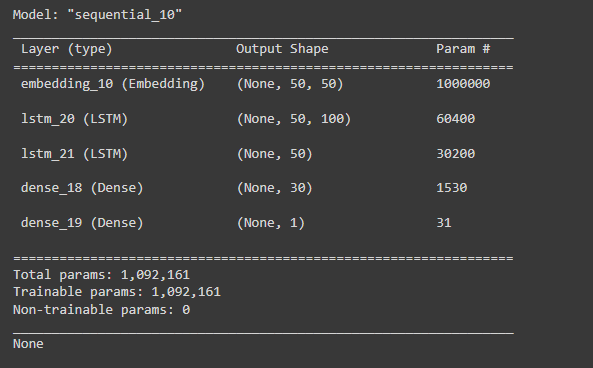
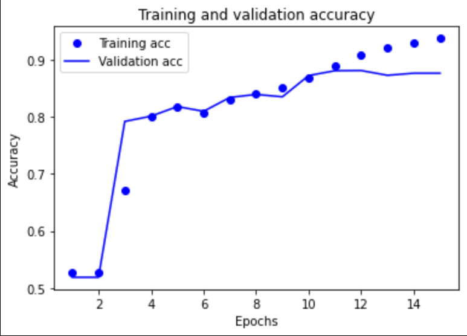
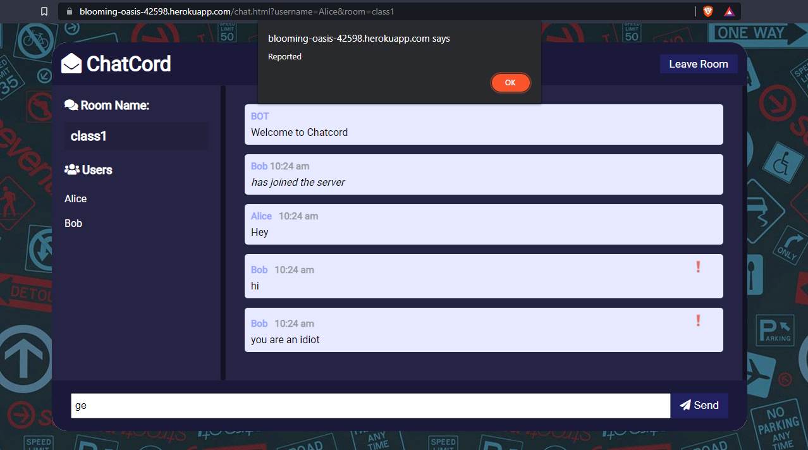
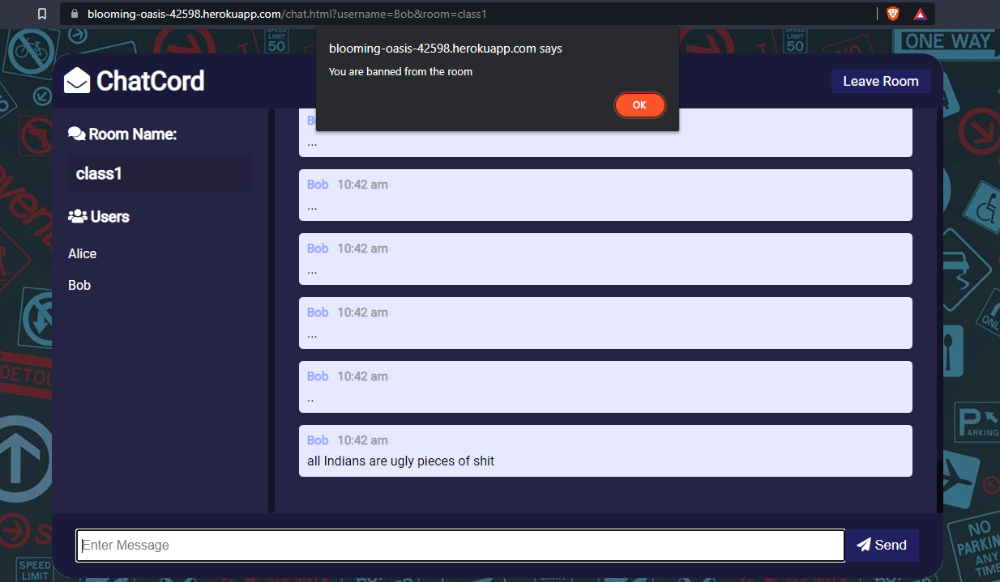

# Cyber Bullying Detector

## Description
A web-based encrypted group chat system which has the functionality of detecting instances of cyber bullying/offensive messages. The chat system uses asymmetric and symmetric cryptography to encrypt the data. A group key is used to encrypt communications and the group key is shared amongst the users using asymmetric cryptography.

## Problem Statement
The problem statement is to design a model which can effectively detect bullies and stop them while securing the privacy of the users which is important as well.

## How to run the code
1. Clone the repository
2. Install the python dependencies by executing `pip install -r requirements.txt`
3. Execute the code cells in the python notebook **NN_detector.ipynb** which generate the model weights and saves them in **Bullying Model** directory
4. Install the NodeJS dependencies by executing  `npm install`
5. Run the server by executing `npm run start` 

## Output
- Neural Network Layers  

- Neural Network Accuracy  

- Chat system demonstation  

